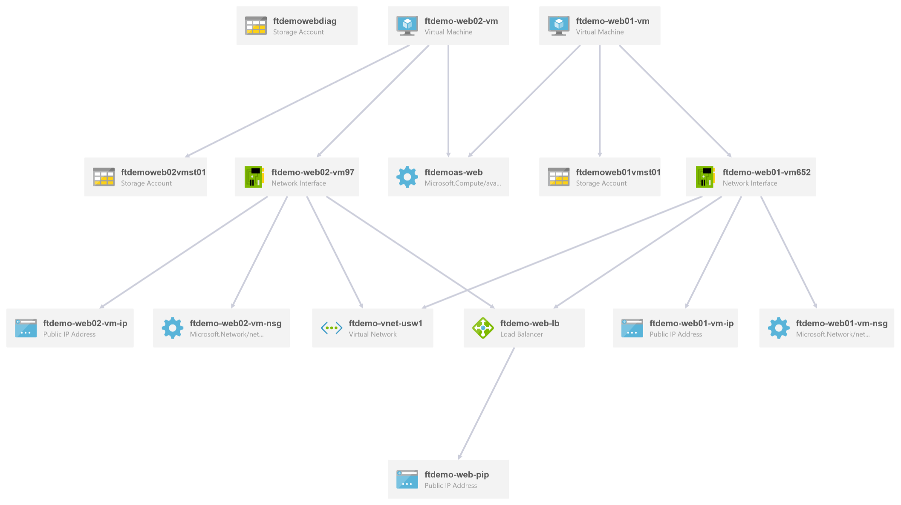

# POC Scenario 1: Deploying Website on Azure IaaS VMs (Red Hat Enterprise Linux) - HTTP

## Table of Contents
* [Abstract](#abstract)
* [Learning objectives](#learning-objectives)
* [Prerequisites](#prerequisites)
* [Estimated time to complete this module](#estimated-time-to-complete-this-module)
* [Customize your Azure Portal](#customize-your-azure-portal)
* [Resource Group creation](#resource-group-creation)
* [Virtual Network Creation](#virtual-network-creation)
* [Virtual Machine Creation](#virtual-machine-creation)
* [Connect to the Virtual Machine](#connect-to-the-virtual-machine)
* [Install HTTPD on the VMs](#install-httpd-on-the-vms)
* [Load Balancer Creation](#load-balancer-creation)
* [Add the VMs to Load Balancer](#add-the-vms-to-load-balancer)
* [Create the load balancing rule for HTTP](#create-the-load-balancing-rule-for-http)
* [Update the NSG (inbound security rule)](#update-the-nsg-inbound-security-rule)
* [Assign DNS name to Load Balancer](#assign-dns-name-to-load-balancer)
* [Testing](#testing)
* [Automation Scripts (ARM Template)](#automation-scripts-arm-template)
* [Visualize your Architecture with ArmViz](#visualize-your-architecture-with-armviz)


# Abstract

During this module, you will learn about bringing together all the infrastructure components to build a sample Linux application and making it scalable, highly available and secure.


* Two Web Servers with Apache will host the website
* An Azure External Load Balancer will distribute the traffice to the Web servers

> Note: This document describes the steps for a proof of concept. Additional steps may be required for a production environment

# Learning objectives
After completing the exercises in this module, you will be able to:
* Create a Resource Group
* Create a Virtual Network
* Create multiple virtual machines
* Create and setup a load balancer
* Create an availability set for VMs
* Update Network Security Groups(NSG)
* Deploy a website in Linux

# Prerequisites 
* Be familiar with the fundamentals of Azure Storage
* Be familiar with the fundamentals of Azure Compute

# Estimated time to complete this module
1.5 hours

# Customize your Azure Portal
* Launch [Azure Portal](https://portal.azure.com/)
* On left most panel, scroll to bottom, then click **More Services**
* Find and Pin, **Virtual networks**
* Find and Pin, **Availability sets**
* Find and Pin, **Load balancers**
* Find and Pin, **Network security groups**

   

# Resource Group creation
  > Note: For all **(prefix)** references, use a globally unique name to be used throughout this walkthrough.

  * Create a Resource Group named **(prefix)-poc-rg**

   

# Virtual Network Creation
  * Create a VNET named **(prefix)-usw2-vnet**
  * Create a Subnet named **(prefix)-web-snet**

   

  * Create a Subnet named **(prefix)-db-snet**

   

# Virtual Machine Creation
  * Create 2 VMs
  * Select from the marketplace, **Red Hat Enterprise Linux 7.3**
  * Name the 1st VM **(prefix)-web01-vm**
  * Name the 2nd VM **(prefix)-web02-vm**
  * Make sure to choose **HDD disk**
  * Choose password Authentication Type and make sure the user name is in lowercase only

  
  > Note: In a production scenario, consider using SSH public key authentication

  * For the size select **D1_V2**
  
  * Create an availability set named **(prefix)-web-as**
  > Note: During the 2nd VM creation pick the previously created Availability set  
  * Below Storage select **Yes** to **Use managed disks**
  * Select the previously create Virtual Network and the Web subnet
  
    

  * Create a Diagnostics Storage account named **(prefix)webdiag**

   

  * After the Virtual machines are created, take note of the Public IP address for each Virtual Machine:

    

  
# Connect to The Virtual Machines

* For Windows download [SSH Putty client](https://www.chiark.greenend.org.uk/~sgtatham/putty/latest.html)

* Open two instances of the putty client and connect to the servers

 

* Click "Yes" on the putty security alert
 

* For Linux or Mac just use the ssh command from the terminal
```bash
ssh azureadmin@<public ip address>
```
 

# Install httpd on the VMs
From the SSH terminal, execute the following instructions on both servers.

  * Elevate privileges to root
  ```bash
  sudo su -
  ```

  * Install HTTP Server
  ```bash
  yum install -y httpd
  ```

  * Install elinks terminal browser for testing
  ```bash
  yum install -y elinks
  ```

 * Configure HTTP to automatic start
  ```bash
  systemctl enable httpd.service
  ```

 * Start HTTP Service
  ```bash
  systemctl start httpd.service
  ```

 * Open firewall port for http
  ```bash
  firewall-cmd --zone=public --add-port=80/tcp --permanent
  firewall-cmd --reload
  ```

 * Create a default page for Web Server 1
  ```bash  
  echo "<h1>This is Webserver 01" > /var/www/html/index.html
  ```   
  * Create a default page for Web Server 2
  ```
  echo "<h1>This is Webserver 02" > /var/www/html/index.html
  ```

 
 * Test default website from the local server
  ```bash
  elinks http://localhost
  ```  
  

  * Press Q to quit elinks
  * Connect via ssh to the second machine and repeat all the steps above.


# Load Balancer Creation
  * From the left panel on the Azure Portal, select **Load balancers**.
  * Click on **Add**
  * Name: **(prefix)-web-lb**
  * Click **Public IP Address**, click **New**
  * Enter name **(prefix)-web-pip**, click **Ok**

     

  * Select **Use Existing** for **Resource Group**, i.e. **(prefix)-poc-rg**, click **Create**

     

  * After the **Load Balancer** is created, select the one you added.

     

  * Under **Settings** select **Health probes**, click **Add**.
  * Enter name **(prefix)-web-prob**, leaving all the defaults, click **Ok**

   

# Add the VMs to Load Balancer
  * Under **Settings** select **Backend pools**, click **Add**.
  * Enter name **(prefix)-web-pool**.
  * For **Associated to**, select **Availability set**.
  * For the **Availability set**, select **(prefix)-web-as**.
  * Click **Add a target network IP configuration** to add the first web server and its IP address.

   

  * **Repeat** the step above to also add the IP configuration for the second web server.
  * Click **OK**.

# Create the load balancing rule for HTTP
  * Under **Settings** select **Load balancing rules**, click **Add**.
  * Enter name **(prefix)-http-lbr**.
    *  Protocol: **TCP**
    *  Port: **80**
    *  Backend port: 80
    *  Backend pool: **(prefix)-web-pool(2VMs)**
    *  Probe: **(prefix)-web-prob(HTTP:80)**
    *  Session Persistence: **None**
    *  Idle timeout (min):**4**
    *  Floating IP (direct server return): **Disabled**
    *  Click **Ok**

   


# Update the NSG (inbound security rule)
## Virtual machine #1
  * From the left panel on the Azure Portal, select **Virtual machines**, then select **(prefix)-web01-vm**.
  * Under **Settings** select **Network Interfaces** 
  * Click on **(prefix)-web01-vm-nsg**.
  * Under **Settings** select **Network Security Groups**.
  * Under **Network Security Group**, click on **(prefix)-web01-vm-nsg**.

   

  * Under **Settings**, click on **Inbound Security Rules**.
  * Click **Add**, Enter name **(prefix)-web01-vm-nsgr-http-allow**
    *  Priority:**1010**
    *  Source: **any**
    *  Service: **HTTP**
    *  Protocol: **TCP**
    *  Port range: **80**
    *  Action: **Allow**

   


## Virtual machine #2
  * From the left panel on the Azure Portal, select **Virtual machines**, then select **(prefix)-web02-vm**.
  * Under **Settings** select **Network Interfaces** 
  * Click on **(prefix)-web02-vm-nsg**.
  * Under **Settings** select **Network Security Groups**.

  

  * Click on **(prefix)-web02-vm-nsg**.
  * Under **Settings**, click on **Inbound Security Rules**.
  * Click **Add**, Enter name **(prefix)-web02-vm-nsgr-http-allow**
    *  Priority:**1010**
    *  Source: **any**
    *  Service: **HTTP**
    *  Protocol: **TCP**
    *  Port range: **80**
    *  Action: **Allow**

   


# Assign DNS name to Load Balancer
  * From the left panel on the Azure Portal, select **Public IP sddresses**.
  * Select **(prefix)-web-pip**.
  * Under Settings, click on **Configuration**.
  * Under DNS name enter **(prefix)**.
      * i.e. http://**(prefix)**.westus2.cloudapp.azure.com/

   

# Testing 
  * Browse to the load balancer public IP or **http://(prefix).westus2.cloudapp.azure.com/**
  * You will see the Web server default page showing either Web Server 01 or 02.
  * If you see Web Server 01, then SSH into VM1, stop the httpd server
  ```bash
  systemctl stop httpd.service
  ```
  * Refresh the web page, you will see Web Server 02. The Load balancer detects VM1 is down and redirects traffic to VM2.

   

  * Start the webserver on all machines
  ```bash
  systemctl start httpd.service
  ```

# Automation Scripts (ARM Template)
  * From the left panel on the Azure Portal, select **Resource Groups**.
  * Select **(prefix)-poc-rg**.
  * Under Settings, click **Download** | **Save As** | (select location)

   

  * After download, **Extract All** to (select location)
  
  

# Visualize your Architecture with ArmViz
  * Open browser and goto **http://armviz.io** to view the template.

   

