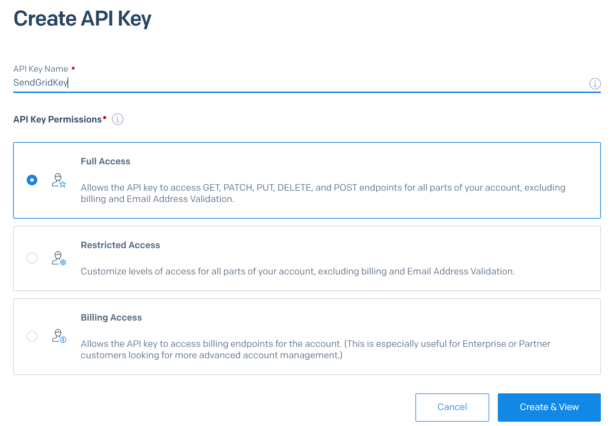

## Contoso Expenses 
A .Net Core Multi-Tier PaaS Sample Application. During this POC you will learn about bringing together various Azure PaaS Services like App Services Web App, API App, Functions, Storage queue & SQL DB to build and deploy a sample Expenses solution.


## Prerequisites
* To complete the Proof of Concept, you will need:
    * A Microsoft Azure subscription (with Owner or Contributor access)

    * Install latest version of [Visual Studio 2017](https://www.visualstudio.com/downloads/) Enterprise with following Workloads:
      * .NET desktop development 
      * ASP.NET and web development 
      * Azure development  
      * Data storage and processing 
    
    * Download latest SQL Server Management Studio [here](https://docs.microsoft.com/en-us/sql/ssms/download-sql-server-management-studio-ssms) and install:
    
    * Download Proof-of-concept project from [here](https://demowebst.blob.core.windows.net/sharecode/ContosoCoreProject.zip)

## Planning
| |Resource Type | Your Name | Name Used in this POC | Description |
| ------------- | ------------- | ------------- | ------------- | ------------- |
| |  Resource Group|   | conexp | The name of the Azure resource group that contains all the required resources of the application we’ll deploy to Azure|
| |  App Service Plan|   | conexpplan | The name of the application service plan, which hosts the virtual ‘hardware’ for the App Service offerings we’ll use (API, Web App, Function)|
| |  Web app|   | conexpweb | The name of your main website |
| |  API App|   | conexpapi | The name of the API your website will call to get cost center information |
| |  SQL Server|   | conexpsql | The name of the SQL server that will host the expenses database |
| |  SQL DB|   | Db1 | The name of the database that will contain the Expense table |
| |  Azure Function |   | conexpfn | The name of the Azure Function that will monitor a queue, trigger on expenses placed on the queue, and send an email to the approver containing the expense information |
| |  Storage account |   | conexpstore | The name of the storage account that will be used by the function and to host a queue |
| | Azure Region |   | Central US | The Azure region that you’d like your resources to be created in, which is the geographic location of the datacenter used to host them |

## Solution Workflow
A user that needs to enter a business expense navigates to the main website.
The user clicks on the Expenses menu, which displays a page that reads that database listing all the expenses that have been entered.
The user can then choose to create a new expense, edit an existing expense, or delete an expense. Each chosen operation navigates to a page that performs the appropriate database operation.
The create page is the most complex. It does the following things:
 * Gathers information about the expense from the fields on the page
 * 	Uses that information to look up the user’s cost center and approver by calling the web API
 * The information from 1 and 2 are combined to create a full expense object
 * The expense object is written to the SQL database
 * The expense object is placed on an Azure storage queue

Finally, when an expense object arrives on the storage queue, the Azure function is triggered, which pulls the expense off the queue and sends an email to the approver with the expense details.

## Infrastructure Creation
### Introduction
You can create the infrastructure in a few different ways. Some of these are:
 * Azure Resource Manager (ARM) templates 
 * PowerShell commands and scripts
 * Azure CLI commands and scripts
 * Through the Azure Portal UI

The first 3 methods above allow you to automate the creation of your infrastructure and treat it as you would source code. The last method is the most intuitive and visual, but more time consuming and not well suited for repeatability. For our purposes here though, intuitive and visual are best, so the UI will be used.

### Creating Resources
* Start a web browser
* Navigate to [Azure Portal](https://portal.azure.com/)
* Sign in with your Azure subscription credentials
* Please note that the initial step for every create section below is to click the Home button, then the Create button in the upper left of the Azure Portal:


* After you click the Create button, you’ll get a search box (as pictured above). The create sections below will tell you what to type in the search box to find the offering you’ll need to create.

### Create the Resource Group

* Click the Home button, then the Create button in the upper right of the portal
* Type ‘resource group’ in the search box
* Click Resource Group in the dropdown
* Click the Create button on the resource group introduction page
* Choose your subscription (if necessary)
* Type in the resource group name that you chose in the planning section
* Set the Azure region you chose in the planning section


* Click the buttons at the bottom of the wizard, accept the defaults all the way through until you get to the final Create button
* Click the final create button and Azure will create the resource group

### Reference
[Resource Group Documentation](https://go.microsoft.com/fwlink/?LinkId=532897)

 ### Create the App Service Plan
* Click the Home button, then the Create button in the upper right of the portal
* Type ‘app service plan’ in the search box
* Click App Service Plan in the dropdown (not the ‘classic’ one)
* Click the Create button on the App Service Plan introduction page
* Select your subscription
* Select the resource group you created
* Type in the name of the App Service Plan that you chose in the planning section
* Set the operating system to Windows
* Choose the Azure region that you decided on in the planning section as the location


* Click the buttons at the bottom of the wizard, accept the defaults all the way through until you get to the final Create button
* Click the final create button and Azure will create the App Service Plan

  ### Reference
  [App Svc Plan Documentation](https://azure.microsoft.com/en-us/documentation/articles/azure-web-sites-web-hosting-plans-in-depth-overview/)
 
 ### Create the Web and API Apps
 Follow the steps below to create the web app, then repeat these same steps to create the API app. The only difference is the name of the app you use in Instance Details, Name. In other words, if you are creating the web app, use the web app name you chose in your planning, if the API app, then use the name you chose for it.

* Click the Home button, then the Create button in the upper right of the portal
Type ‘web app’ in the search box
* Click Web App in the dropdown
* Click the Create button on the Web App introduction page
* Select your subscription
* Select the resource group you created
* Type in the name of the web app (or API app) that you chose in the planning section
* Set Publish to code
* Set the Runtime stack to .Net Core 2.2
* Set the operating system to Windows
* Choose the Azure region that you decided on in the planning section as the location
* Choose the app service plan you created


* Click the Monitoring tab at the top of the dialog
* Set Enable Application Insights to No


* Click the buttons at the bottom of the wizard, all the way through until you get to the final Create button
* Click the final create button and Azure will create the web (or API) app

  ### Reference
  [Web App Documentation](http://azure.microsoft.com/documentation/services/web-sites/)
 
 ### Create the Azure Function
 
* Click the Home button, then the Create button in the upper right of the portal
* Type ‘function app’ in the search box
* Click Function App in the dropdown
* Click the Create button on the Function App introduction page
* Type the name you chose for your Function App in the planning section
* Select your subscription
* Select Use Existing and the resource group you created in the dropdown
* Set the OS to Windows
* Select App Service Plan in the Hosting Plan dropdown
* Select the hosting plan that you created in App Service plan/location
* Set runtime stack to .Net
* Select Create new for Storage and type in the name you decided on for the storage account in your planning
* Set Application Insights to disabled
 


* Click Create and Azure will create the function for you
 
  ### Reference
  [Function App Documentation](http://go.microsoft.com/fwlink/?LinkID=747839)
  
 ### Create the SQL Server and the Database
* Click the Home button, then the Create button in the upper right of the portal
* Type ‘sql database’ in the search box
* Click SQL Database in the dropdown
* Click the Create button on the SQL Database introduction page
* Select your subscription
* Select the resource group you created
* Type in the database name that you chose in the planning section


* For Server, click Create New just below the ‘select a server’ box


* Click the buttons at the bottom of the wizard, all the way through until you get to the final Create button
* Click the final create button and Azure will create the SQL Server and database

  ### Reference
 [SQL Server Documentation](http://azure.microsoft.com/documentation/services/sql-database/)
 
  #### SendGrid Account
  
* Click the Home button, then the Create button in the upper right of the portal
* Type ‘sendgrid’ in the search box
* Click SendGrid in the dropdown
* Click the Create button on the SendGrid introduction page
* Type the name you chose for your SendGrid account in the name field
* Type a password and confirm it – note your password down somewhere as you’ll need it later
* Select your subscription
* Select Use existing resource group and choose your resource group from the dropdown
* Choose the free pricing tier
* Fill out your contact information (make sure to use a valid email address that you can access as you’ll need to verify your account)
* Accept the legal terms
* Click Create


* Once the SendGrid account is created, click on Resource Groups in the Azure portal left nav menu
* Click on your resource group
* Click on your SendGrid account
* Click on the Manage button on the top


* SendGrid will prompt you to verify your account since it is your first sign-in. Follow the instructions to do so.
* Once the account is verified, you’ll be able to access your SendGrid management screen
* On the left nav menu of the SendGrid management screen, click Settings
* Under Settings, click API Keys


* Click the Create API Key button in the upper right
* Type an API key name
* Choose Full Access
* Click Create & View



* You will be presented with a key in the form of a long text string
* Select the key and copy the key to notepad or some place where you can retrieve it because SendGrid will not show it to you again
* Your SendGrid account is ready for use. You will need the key later for configuring the application.

### Code Deployment
## Deploy the Web and API Apps
* Open the ContsoCore solution file in Visual Studio
* Right-click on Contoso.Expenses.API
* Choose Publish


* Click the Start button on the publish page


* Select App Service as the publish target
* Choose Select Existing for the App Service
* Click publish in the lower right


* You may need to log in to Azure using the button in the upper right of the dialog, if not already logged in
* Choose your subscription
* Choose the Resource Group view
* Click to expand the folder with the name you chose for your resource group in the planning section
* Click on the API app with the name you chose in the planning section
* Click OK in the lower right


* You should see the publish status in Visual Studio’s output window. After 30 seconds or so, it should succeed and open a browser displaying the site.
* Repeat the steps in this section for the Contoso.Expenses.Web app. In other words, right click on the Contoso.Expenses.Web project and choose publish. When you get to the selection of the App Service, select the name of your web app from the resource group folder (instead of the API app service).

## Deploy the Function App

* Right-click on the Contoso.Expenses.Function project and choose Publish
* Click the Start button
* Select Azure Function App as the Publish target
* Choose Select Existing from the Azure App Service
* Check Run from package file
* Click the publish button in the lower right


* Log into Azure if necessary (upper right)
* Choose your subscription
* Choose Resource Group view
* Open the folder with your resource group name
* Choose your function app
* Click OK


* You should see the publish status and success in Visual Studio’s output window

## Deploy the Database
* Click on Resource Groups on the Portal left nav
* Click on your resource group
* Click on your SQL Server name
* Click on Firewalls and virtual networks (under Security)
* Click on Add client IP
* Click on Save


* This allows your machine and Visual Studio to access your DB
* Back in Visual Studio, right-click on the Contoso.Expenses.Web project in Solution Explorer
* Choose Manage User Secrets from the menu
* Secrets.json will open in the Visual Studio editor
* Edit the contents of the file, creating a JSON object named “ConnectionStrings” containing two properties, DBConnectionString and StorageConnectionString
* Use the template below to create the value for DBConnectionString. It is a standard ADO SQL connection string. Use substitute these {values} for the names you chose in the planning section

````JSON
Server=tcp:{SQL Server}.database.windows.net,1433;Initial Catalog={SQL DB};Persist Security Info=False;User ID={SQL Admin User};Password={SQL Admin Password};MultipleActiveResultSets=False;Encrypt=True;TrustServerCertificate=False;Connection Timeout=30;
````
* You can leave the StorageConnectionString empty for our purposes now
* Your secrets.json file should look similar to the one below:


* Save your secrets.json file
* Click on or open the Visual Studio Package Manager Console
* Set the default project to Contoso.Expenses.Common
* Type Update-database at the PM> prompt


* The package manager should be able connect to the DB, using the connection string you created and saved, to create the Expenses table in Azure SQL.

## Configuration
### Configure the Azure Function

* Click on Resource Groups on the Portal left nav
* Click on your resource group
* Click on your function
* Click on your function name on the left
* Click on the Platform features tab
* Click Configuration under General Settings


* Under Application Settings, click on New application setting
* Add the SendGridKey application setting name
* Paste in your SendGrid API key
* Click the Update Button in the bottom right


* Click the Save button on the top to save the application setting
* Find the AzureWebJobsStorage setting and click on its edit button on the right


* Copy the value out of the Value box and paste it in notepad or some other tool where you can retrieve it again for later configuration steps
* What you have copied is the connection string to the storage account that the function uses for its own storage. The web application will place expenses on a queue in this storage account. You could use any storage account as long as you configure both the function and web app with the proper application settings and connection string to it. It is just easier for our purposes here to leverage the account the function is already using.

### Configure the Web App

* Click on Resource Groups on the Portal left nav
* Click on your resource group
* Click on your Web App
* Click on Configuration
* Click on New Connection String, under Connection Strings


* Type StorageConnectionString in the setting name. For the Value, paste in the connection string captured from the Azure Function AzureWebJobsStorage application setting captured earlier while configuring the Azure Function.
* Click the Update button on the bottom


* Type DBConnectionString for the setting name
* Paste in the SQL connection string you created earlier for Value
* Set the Type to SQLAzure
* Click the Update button on the bottom


* Click the Save button at the top of the application settings screen

