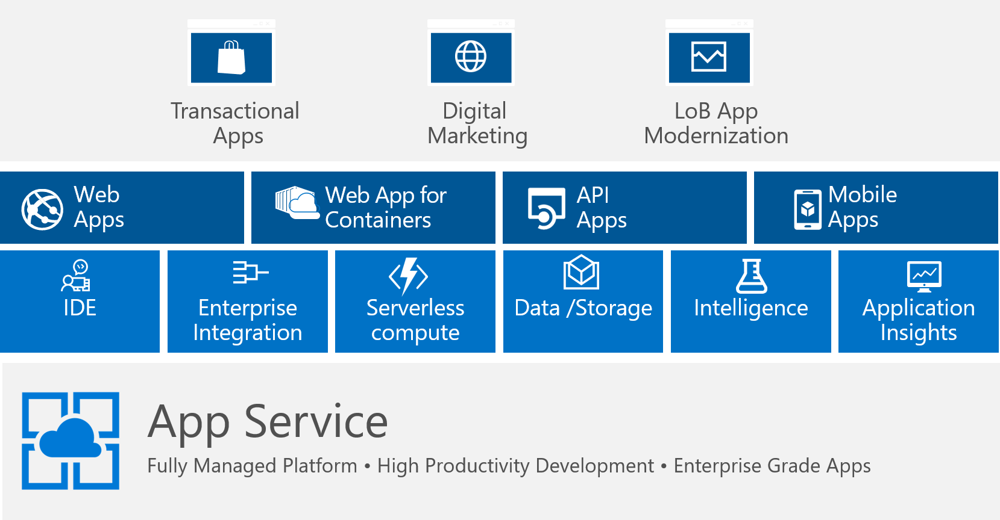

# Platform as a Service (PaaS) Overview
In this session, we will discuss PaaS as an approach and outline some of the service that make up some of these services.

## What is PaaS

Platform as a service (PaaS) is a complete development and deployment environment in the cloud, with resources that enable you to deliver everything from simple cloud-based apps to sophisticated, cloud-enabled enterprise applications. You purchase the resources you need from a cloud service provider on a pay-as-you-go basis and access them over a secure Internet connection.

### Common PaaS scenarios
Organizations typically use PaaS for these scenarios:

* Development framework

* Analytics or business intelligence

* Additional services

### Advantages of PaaS

* Cut coding time

* Add development capabilities without adding staff

* Develop for multiple platforms—including mobile—more easily

* Use sophisticated tools affordably

* Support geographically distributed development teams

* Efficiently manage the application lifecycle

https://azure.microsoft.com/en-us/overview/what-is-paas/

### PaaS Platform

> **NOTES**

When it comes to Azure PaaS there are many different ways to build & deploy your applications on Azure. Azure App Service , Service Fabric, Azure Functions, Azure Container Service, etc.

The common application scenarios of choosing PaaS include: 
* Transactional Apps
* Digital Marketing
* LOB Apps 

## App Services

App Services comprises a number of different services all under the same umbrella platform.

> **NOTES**
Since everything exists as an "app service" there are not really features that are specific to each platform and most of the functionality is shared between the different flavors.

### Web Apps

Azure App Service Web Apps is a service for hosting web applications, REST APIs, and mobile back ends with first-class support for .NET Framework, .NET Core, Java, Ruby, Node.js, PHP, and Python. 

You can easily take advantage of its DevOps capabilities, such as Continuous Integration & Continuous deployment with VSTS, GitHub, Docker Hub or Azure Container Service with few clicks. Promote updates through test and staging environments.

Finally from a Security and compliance perspective, App Service is ISO, SOC, and PCI compliant. You can also authenticate users with Azure Active Directory or with social login like Google, Facebook, Twitter, or Microsoft Account.

> **NOTES**
Web apps support both Windows and Linux based hosts. It is important to note that not all features are available for each platform and you need to verify the specific features needed when making a decision about which one to choose.

### Web Apps for Containers

App Services also support running containers. If you are already working with containers today or working with a language that is not currently supported e.g. Golang, you can run your application in a container on App Services.

This allows containers to take advantage of the platform and auto scale your app based on various metrics like CPU, memory usage, etc.

https://docs.microsoft.com/en-us/azure/app-service/containers/app-service-linux-intro

> **NOTES**
Similar to App Services with Linux, not all features are available for container implementations and requirements need to be validated before making the decision to use them.

### API Apps

Azure API Apps provide a platform and ecosystem for building, consuming, and distributing APIs in the cloud and on-premises. They support Swagger to generate cross-platform client SDKs in Visual Studio.

Other features supported by API Apps include:
* Turn-key CORS support
* Easy Auth authentication to integrate you API with Azure AD, social network single sign-on, or OAuth with no code changes required
* Integration with API Management, Logic Apps, and many other Azure services

### Mobile Apps
The Mobile Apps feature of Azure App Service gives enterprise developers and system integrators a mobile-application development platform that's highly scalable and globally available.

With the mobile apps client SDK, offline sync features can be enabled which allow you to build robust and responsive mobile applications that operate with an offline dataset. This dataset can automatically then sync with the back-end data when connectivity is available.

Mobile apps also support push notifications capabilities.

## Azure Functions

Azure Functions provide a serverless compute layer for your application. This allows for event based programming to allow for the creation of your compute layer on demand.

Ideal uses cases for functions are:
* Data processing (e.g. image processing or order processing, file maintenance, long-running tasks, scheduled tasks)
* System integration
* IoT systems
* Simple microservice APIs

https://azure.microsoft.com/en-us/services/functions/

> **NOTES**
Since Functions are serverless, you pay for only the CPU and memory of the function as it executes.

## Logic Apps

Logic Apps are a serverless integration layer. This allows an application to build workflows, consume other Azure services, talk to 3rd party SaaS solutions, or consume other custom APIs without having to write code.

Logic Apps support hybrid scenarios and can connect to on-premise as well as cloud resources and applications.

https://azure.microsoft.com/en-us/services/logic-apps/

Logic Apps use connectors to integrate various components and services in a workflow. These can be either standard connectors from the marketplace or you can create your own API connectors if a built in one is not available.

A list of available connectos are here:
https://azure.microsoft.com/en-us/documentation/articles/app-service-logic-connectors-list/ 

> **NOTES**
Since Logic Apps are serverless, you pay for only the time the action in the workflow executes.

## App Modernization

There are a lot of options to pick from when it comes to choosing whether or not to simply rehost the application or to start the process of modernizing it. The below table offers some pointers to consider which approach to take based on the objectives desired.

<table>
    <tr>
        <th>Objectives</th>
        <th>Migrate</th>
        <th colspan=3>Modernize</th>
        <th>Options</th>
    </tr>
    <tr>
        <th></th>
        <th>Rehost</th>
        <th>Refactor</th>
        <th>Rearchitect</th>
        <th>Rebuild</th>
        <th></th>
    </tr>
    <tr>
        <td>Achieve rapid time to cloud <i>Allow migration with minimal architectural impact</i></td>
        <td>✔</td>
        <td></td>
        <td></td>
        <td></td>
        <td>IaaS</td>
    </tr>
    <tr>
        <td>Reduce capital expenditure of existing applications <i>Switch to pay-as-you-go model, realize better budget forecasting</i></td>
        <td>✔</td>
        <td></td>
        <td></td>
        <td></td>
        <td>IaaS</td>
    </tr>
    <tr>
        <td>Free up data center space quickly <i>Free up or consolidate resources for apps that must reside on-premises</i></td>
        <td>✔</td>
        <td></td>
        <td></td>
        <td></td>
        <td>IaaS</td>
    </tr>
    <tr>
        <td>Leveraging existing investments <i>Across dev/ops, developer experience, tooling, infrastructure and deployed apps</i></td>
        <td>✔</td>
        <td>✔</td>
        <td>✔</td>
        <td></td>
        <td>PaaS, Containers</td>
    </tr>
    <tr>
        <td>Meet scalability requirements of existing apps more cost effectively <i>Optimize application architecture for cloud scale</i></td>
        <td></td>
        <td>✔</td>
        <td>✔</td>
        <td></td>
        <td>Paas, Containers</td>
    </tr>
    <tr>
        <td>Enable business agility with continuous innovation <i>Increase DevOps agility across teams</i></td>
        <td></td>
        <td>✔</td>
        <td>✔</td>
        <td>✔</td>
        <td>PaaS, Serverless</td>
    </tr>
    <tr>
        <td>More easily integrate with other web and cloud apps <i>Leverage PaaS, increase productivity with Serverless</i></td>
        <td></td>
        <td></td>
        <td>✔</td>
        <td>✔</td>
        <td>PaaS, Serverless</td>
    </tr>
    <tr>
        <td>Provide multichannel access, including mobile and IoT <i>Enable wider, secure access to applications, support range of devices</i></td>
        <td></td>
        <td></td>
        <td></td>
        <td>✔</td>
        <td>PaaS, Serverless</td>
    </tr>
    <tr>
        <td>Deliver new and breakthrough capabilities faster <i>Optimize for developer productivity, build apps faster</i></td>
        <td></td>
        <td></td>
        <td></td>
        <td>✔</td>
        <td>PaaS, Serverless</td>
    </tr>
</table>

> Source: Gartner - Decision Point for Choosing a Cloud Application Migration Strategy published March 2016

The Azure Architecture Center also provides guidance for making decisions on which technologies / solutions make sense given the state of the application.

https://docs.microsoft.com/en-us/azure/architecture/guide/technology-choices/compute-decision-tree#flowchart
